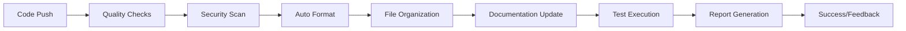

# 🤖 AI Script Inventory - Superhuman Workflow System

[](https://github.com/JLWard429/ai-script-inventory-/actions/workflows/code-quality.yml)
[](https://github.com/JLWard429/ai-script-inventory-/actions/workflows/ci-cd.yml)
[](https://github.com/JLWard429/ai-script-inventory-/actions/workflows/auto_organize.yml)

This repository contains a curated collection of AI-related scripts and tools, enhanced with a **superhuman AI workflow system** that automates code organization, quality assurance, security scanning, and documentation management.

## ✨ What Makes This "Superhuman"?

Our workflow system performs tasks more consistently and thoroughly than manual processes:

- 🔄 **Automated Organization**: Files are intelligently sorted and organized
- 🛡️ **Security-First**: Every commit is scanned for vulnerabilities
- 📊 **Quality Assurance**: Multi-layer code quality checks and formatting
- 📚 **Self-Documenting**: Documentation updates automatically with code changes
- 🧪 **Comprehensive Testing**: Multi-version testing with coverage tracking
- ⚡ **Performance Optimized**: Efficient workflows with smart caching and parallelization

## 🚀 Quick Start

### For Users

```bash
# Clone the repository
git clone https://github.com/JLWard429/ai-script-inventory-.git
cd ai-script-inventory-

# Install development tools (optional, for contributing)
pip install -r requirements-dev.txt

# Set up pre-commit hooks (for contributors)
pre-commit install
```

### For Contributors

```bash
# Make your changes
git add .
git commit -m "Your descriptive commit message"
git push

# The superhuman workflow automatically:
# ✅ Formats your code
# ✅ Runs security scans
# ✅ Organizes files by type
# ✅ Updates documentation
# ✅ Runs comprehensive tests
# ✅ Provides detailed feedback
```

## 📁 Repository Structure

```
ai-script-inventory/
├── 🐍 python_scripts/     # Python scripts and AI tools
├── 🔧 shell_scripts/      # Shell scripts and CLI utilities  
├── 📚 docs/               # Documentation and guides
├── 📄 text_files/         # Config files, logs, and data
├── 🧪 tests/              # Test suite
├── ⚙️ .github/            # Automation workflows and scripts
├── 📋 requirements-dev.txt # Development dependencies
├── ⚙️ pyproject.toml       # Project configuration
├── 📖 WORKFLOW.md          # Detailed workflow documentation
└── 🔒 .pre-commit-config.yaml # Code quality hooks
```

## 🛠️ Key Components

### 🤖 Automated File Organization

Files are automatically organized by type using intelligent detection:

- `.py` files → `python_scripts/`
- `.md` files → `docs/`
- `.sh` files → `shell_scripts/`
- `.txt`, `.json`, `.yaml` → `text_files/`

### 🔍 Code Quality Pipeline

**Multi-layer quality assurance:**

- **Formatting**: Black (Python), Prettier (JSON/YAML)
- **Linting**: flake8, mypy for type checking
- **Security**: Bandit for vulnerability scanning
- **Dependencies**: Safety for known vulnerabilities
- **Testing**: pytest with coverage reporting

### 🛡️ Security Features

- Automated vulnerability scanning on every commit
- Dependency security monitoring
- Pre-commit security hooks
- Secrets detection and prevention

### 📊 Monitoring & Reporting

- Comprehensive workflow summaries
- Code coverage tracking
- Security vulnerability reports
- Performance metrics and optimization

## 🚦 Workflow Status

The repository runs three main automated workflows:

1. **🔧 Code Quality & Security** - Runs on every push/PR
2. **🚀 CI/CD Pipeline** - Comprehensive testing and validation
3. **📁 Auto Organization** - Keeps repository structure clean

Check the [Actions tab](https://github.com/JLWard429/ai-script-inventory-/actions) for real-time status.

## 📖 Documentation

- 📋 **[WORKFLOW.md](WORKFLOW.md)** - Complete workflow system documentation
- 🤝 **[CONTRIBUTING.md](CONTRIBUTING.md)** - Contribution guidelines
- 🔒 **[SECURITY.md](SECURITY.md)** - Security policies and procedures
- 📚 **[docs/](docs/)** - Additional documentation and guides

## 🎯 Use Cases

### AI Researchers & Developers
- Prototype and share AI scripts with automatic quality assurance
- Collaborate on AI tools with automated code review
- Maintain clean, documented codebases

### DevOps & MLOps Engineers
- Implement ML automation scripts with built-in security scanning
- Deploy AI workflows with confidence through comprehensive testing
- Maintain infrastructure as code with quality guarantees

### Students & Educators
- Learn best practices through automated feedback
- Share educational AI content with proper organization
- Demonstrate professional development workflows

## 🔄 Automation in Action

When you push code, here's what happens automatically:



## 📈 Metrics & Performance

- **🎯 Quality Score**: Automated code quality scoring
- **🛡️ Security Rating**: Vulnerability assessment results
- **📊 Coverage**: Test coverage percentage
- **⚡ Performance**: Workflow execution times
- **🔄 Efficiency**: Automation success rates

## 🤝 Contributing

We welcome contributions! The superhuman workflow system makes contributing easy:

1. **Fork** the repository
2. **Create** a feature branch
3. **Make** your changes (automation handles quality)
4. **Submit** a pull request
5. **Review** automated feedback
6. **Merge** after approval

See [CONTRIBUTING.md](CONTRIBUTING.md) for detailed guidelines.

## 📄 License

This project is licensed under the MIT License - see the [LICENSE](LICENSE) file for details.

## 🙏 Acknowledgments

- Built with modern DevOps best practices
- Inspired by superhuman automation principles
- Powered by GitHub Actions and Python tooling
- Community-driven development approach

---

**Ready to experience superhuman workflow automation?** 🚀

[Get Started](#-quick-start) | [View Workflows](https://github.com/JLWard429/ai-script-inventory-/actions) | [Read Documentation](WORKFLOW.md) | [Contribute](CONTRIBUTING.md)
