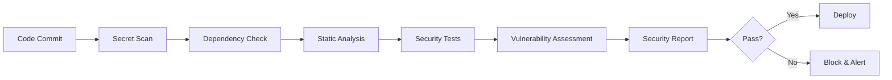

# 🔒 Security Policy

## 🛡️ Overview

The AI Script Inventory project takes security seriously. Our superhuman AI workflow system includes multiple layers of automated security scanning and validation to ensure the safety and integrity of all code and contributions.

## 🚨 Reporting Security Vulnerabilities

If you discover a security vulnerability, please help us protect our users by following responsible disclosure practices.

### 📧 How to Report

**For critical security issues:**
- Email: [security@example.com] (replace with actual email)
- Subject: `[SECURITY] Brief description of the issue`
- Include: Detailed description, reproduction steps, and potential impact

**For general security concerns:**
- Open a [GitHub Security Advisory](https://github.com/JLWard429/ai-script-inventory-/security/advisories)
- Use our security issue template

### ⚡ Response Timeline

- **Acknowledgment**: Within 24 hours
- **Initial Assessment**: Within 72 hours  
- **Status Update**: Weekly until resolved
- **Resolution**: Varies by severity (see below)

## 🎯 Severity Levels

### 🔴 Critical (P0)
- **Timeline**: Fix within 24 hours
- **Examples**: 
  - Remote code execution
  - Privilege escalation
  - Data breach potential
  - Hardcoded secrets in public repositories

### 🟠 High (P1)
- **Timeline**: Fix within 1 week
- **Examples**:
  - Authentication bypass
  - Sensitive data exposure
  - Injection vulnerabilities
  - Insecure defaults

### 🟡 Medium (P2)
- **Timeline**: Fix within 2 weeks
- **Examples**:
  - Cross-site scripting (XSS)
  - Information disclosure
  - Insecure dependencies
  - Weak cryptography

### 🟢 Low (P3)
- **Timeline**: Fix within 1 month
- **Examples**:
  - Minor information leaks
  - Security misconfigurations
  - Non-exploitable vulnerabilities
  - Best practice violations

## 🔍 Automated Security Measures

Our superhuman workflow system includes comprehensive security automation:

### 🤖 Continuous Monitoring

**On Every Commit:**
- **Bandit**: Static security analysis for Python
- **Safety**: Dependency vulnerability scanning
- **Secret Detection**: Hardcoded secret identification
- **License Scanning**: Open source license compliance

**On Every Pull Request:**
- **CodeQL**: Semantic code analysis
- **Dependency Review**: New dependency risk assessment
- **Security Policy Compliance**: Automated policy checking

### 🛠️ Security Tools Integration

```yaml
# Example security check configuration
security_tools:
  bandit:
    - Skip: [B101]  # Skip assert_used test
    - Severity: medium
    - Confidence: high
  
  safety:
    - Check: dependencies
    - Database: updated_daily
    - Fail_on: medium_or_higher
  
  secrets:
    - Patterns: api_keys, passwords, tokens
    - Entropy: high_randomness_detection
    - File_types: all_text_files
```

## 🔐 Security Best Practices

### For Contributors

#### ✅ Secure Coding Practices

**Python:**
```python
# ✅ Good: Use environment variables for secrets
import os
api_key = os.getenv("API_KEY")
if not api_key:
    raise ValueError("API_KEY environment variable required")

# ✅ Good: Input validation
def process_user_input(user_input: str) -> str:
    if not isinstance(user_input, str):
        raise TypeError("Input must be a string")
    # Sanitize and validate input
    sanitized = user_input.strip()[:100]  # Limit length
    if not sanitized.isalnum():
        raise ValueError("Input contains invalid characters")
    return sanitized

# ❌ Bad: Hardcoded secrets
api_key = "sk-1234567890abcdef"  # Will be caught by automation!

# ❌ Bad: SQL injection risk
query = f"SELECT * FROM users WHERE id = {user_id}"  # Dangerous!
```

**Shell Scripts:**
```bash
# ✅ Good: Input validation
validate_input() {
    local input="$1"
    if [[ ! "$input" =~ ^[a-zA-Z0-9_-]+$ ]]; then
        echo "Error: Invalid input format" >&2
        return 1
    fi
}

# ✅ Good: Secure file operations
readonly TEMP_FILE=$(mktemp)
trap 'rm -f "$TEMP_FILE"' EXIT

# ❌ Bad: Command injection risk
eval "$user_input"  # Extremely dangerous!

# ❌ Bad: Insecure temporary files
echo "$data" > /tmp/insecure_file  # Predictable filename!
```

#### 🔒 Dependency Management

**Requirements:**
- Keep dependencies up to date
- Use specific version pinning
- Review new dependencies for security issues
- Prefer well-maintained packages

```python
# pyproject.toml - Good dependency specification
[project]
dependencies = [
    "requests>=2.31.0,<3.0.0",  # Specific, secure version range
    "cryptography>=41.0.0",     # Latest security patches
]

[project.optional-dependencies]
dev = [
    "bandit>=1.7.5",           # Security linting
    "safety>=3.0.0",           # Vulnerability scanning
]
```

### For Maintainers

#### 🔑 Access Control

- **Principle of Least Privilege**: Minimal necessary permissions
- **Two-Factor Authentication**: Required for all maintainers
- **Regular Access Reviews**: Quarterly permission audits
- **Secure Secrets Management**: Use GitHub Secrets, never commit secrets

#### 📋 Security Checklist for Releases

- [ ] All dependencies updated to latest secure versions
- [ ] Security scans completed with no high/critical issues
- [ ] Code review completed by at least two maintainers
- [ ] Release notes include security improvements
- [ ] Security advisory published if applicable

## 🚫 What We Protect Against

### 🎯 Common Attack Vectors

**Code Injection:**
- SQL injection prevention
- Command injection detection
- Script injection blocking
- Template injection protection

**Data Exposure:**
- Hardcoded secret detection
- Sensitive data identification
- Information leakage prevention
- Log sanitization

**Supply Chain Attacks:**
- Dependency vulnerability scanning
- License compliance checking
- Malicious package detection
- Build integrity verification

### 🛡️ Defense Strategies

**Prevention:**
- Automated security scanning
- Secure coding guidelines
- Regular security training
- Threat modeling

**Detection:**
- Continuous monitoring
- Anomaly detection
- Log analysis
- Vulnerability assessments

**Response:**
- Incident response plan
- Automated containment
- Quick patching process
- Communication protocols

## 📊 Security Metrics

We track and monitor:

- **Vulnerability Response Time**: Average time to fix security issues
- **Scan Coverage**: Percentage of code covered by security tools
- **Dependency Health**: Number of vulnerable dependencies
- **Security Score**: Overall security posture rating

### 🏆 Security Goals

- **Zero Known High/Critical Vulnerabilities**: In production code
- **100% Secret Detection Coverage**: All commits scanned
- **24-hour Response Time**: For critical security issues
- **Monthly Security Updates**: Regular dependency updates

## 🔄 Security Workflow Integration

### Pre-commit Security Hooks

```yaml
# .pre-commit-config.yaml security hooks
repos:
  - repo: https://github.com/PyCQA/bandit
    rev: 1.7.5
    hooks:
      - id: bandit
        args: ["-c", "pyproject.toml"]
        
  - repo: https://github.com/Lucas-C/pre-commit-hooks-safety
    rev: v1.3.2
    hooks:
      - id: python-safety-dependencies-check
      
  - repo: https://github.com/Yelp/detect-secrets
    rev: v1.4.0
    hooks:
      - id: detect-secrets
```

### CI/CD Security Pipeline



## 📚 Security Resources

### Internal Documentation
- [Secure Coding Guidelines](docs/security/coding-guidelines.md)
- [Incident Response Plan](docs/security/incident-response.md)
- [Security Tool Configuration](docs/security/tool-config.md)

### External Resources
- [OWASP Top 10](https://owasp.org/www-project-top-ten/)
- [NIST Cybersecurity Framework](https://www.nist.gov/cyberframework)
- [Python Security Best Practices](https://python.org/dev/security/)
- [GitHub Security Best Practices](https://docs.github.com/en/code-security)

## 🏅 Security Acknowledgments

We appreciate security researchers and contributors who help keep our project secure:

### Hall of Fame
*(Contributors who have reported valid security issues will be listed here)*

### Recognition Program
- **Public Recognition**: Listed in security acknowledgments
- **GitHub Badge**: Special contributor status
- **Swag Rewards**: For significant security contributions
- **Direct Contact**: Invitation to security advisory team

## 📞 Emergency Contacts

**For immediate security concerns:**
- **GitHub Security**: [@security-team] (replace with actual handles)
- **Project Maintainers**: [@maintainer1], [@maintainer2]
- **Security Email**: security@example.com

**Business Hours:**
- Monday-Friday: 9 AM - 5 PM UTC
- Emergency Response: 24/7 for critical issues

## 🔄 Policy Updates

This security policy is reviewed and updated:
- **Quarterly**: Regular policy review
- **As Needed**: When new threats emerge
- **After Incidents**: Lessons learned integration
- **Community Feedback**: Based on user suggestions

**Last Updated**: [Current Date]
**Next Review**: [Next Quarter]

---

**Remember**: Security is everyone's responsibility. When in doubt, err on the side of caution and report the issue. Thank you for helping keep the AI Script Inventory secure! 🛡️