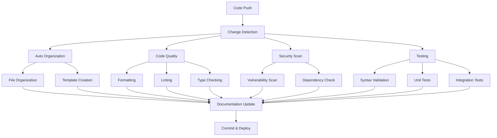

# 🚀 Superhuman AI Workflow System

## Overview

This repository implements a comprehensive, automated workflow system designed to maintain code quality, ensure security, and streamline development processes for AI-related scripts and tools. The system is built around the concept of "superhuman" automation - meaning it performs tasks more consistently and thoroughly than manual processes.

## 🎯 Core Principles

1. **Automation First**: Every repetitive task should be automated
2. **Quality Assurance**: Multiple layers of validation and testing
3. **Security by Default**: Automated security scanning and vulnerability detection
4. **Documentation Driven**: Self-documenting code and processes
5. **Continuous Improvement**: Metrics and feedback loops for optimization

## 🏗️ System Architecture

### Workflow Components



## 🔧 Automation Components

### 1. Repository Organization System

**File**: `.github/scripts/organize_ai_scripts.py`

**Purpose**: Automatically organizes files by type into appropriate directories

**Features**:
- Intelligent file type detection and routing
- Conflict resolution with timestamping
- Syntax validation before moving files
- Template creation for missing documentation
- Comprehensive audit reporting
- Dry-run capability for testing

**Triggered by**:
- File changes in script directories
- Manual workflow dispatch
- Scheduled runs (can be configured)

**Organization Rules**:
```python
DESTINATIONS = {
    '.py': 'python_scripts',      # Python scripts and tools
    '.md': 'docs',                # Documentation files
    '.sh': 'shell_scripts',       # Shell scripts and utilities
    '.txt': 'text_files',         # Text files, configs, logs
    '.json': 'text_files',        # JSON configuration files
    '.yaml': 'text_files',        # YAML configuration files
    '.yml': 'text_files',         # YAML configuration files
}
```

### 2. Code Quality Pipeline

**Files**: `.github/workflows/code-quality.yml`, `.github/workflows/ci-cd.yml`

**Purpose**: Ensures consistent code quality across all contributions

**Components**:

#### Code Formatting
- **Black**: Automatic Python code formatting
- **isort**: Import sorting and organization
- Runs on multiple Python versions (3.8-3.12)

#### Linting
- **flake8**: Style and error checking
- **mypy**: Static type checking
- Custom rules defined in `pyproject.toml`

#### Security Scanning
- **Bandit**: Security vulnerability scanning for Python
- **Safety**: Dependency vulnerability checking
- **Pre-commit hooks**: Additional security checks

### 3. Testing Infrastructure

**Purpose**: Comprehensive testing to ensure reliability

**Components**:
- **Syntax Validation**: All scripts checked for valid syntax
- **Unit Tests**: Individual component testing
- **Integration Tests**: End-to-end workflow testing
- **Coverage Reporting**: Track test coverage metrics

**Test Structure**:
```
tests/
├── test_basic.py           # Repository structure tests
├── test_organization.py    # Organization script tests
├── test_workflows.py       # GitHub Actions tests
└── test_security.py        # Security and validation tests
```

### 4. Documentation System

**Purpose**: Maintain up-to-date, comprehensive documentation

**Features**:
- Auto-generated README files for each directory
- Workflow documentation (this file)
- API documentation for scripts
- Contributing guidelines
- Setup instructions

## 🚦 Workflow Triggers

### Automatic Triggers

1. **Push to main/develop branches**
   - Triggers: Code quality, testing, organization
   - Actions: Format, lint, test, organize, document

2. **Pull Request creation**
   - Triggers: Full validation pipeline
   - Actions: All quality checks, security scans, tests

3. **File changes in script directories**
   - Triggers: Organization workflow
   - Actions: Auto-organization, template creation

### Manual Triggers

1. **Workflow Dispatch**
   - Available for all workflows
   - Useful for testing and maintenance

2. **Release Tags** (v*)
   - Triggers: Release pipeline
   - Actions: Create release, generate changelog

## 🔍 Quality Gates

### Pre-commit Checks
```yaml
- Trailing whitespace removal
- End-of-file fixing
- YAML/JSON validation
- Large file detection
- Merge conflict detection
- Code formatting (Black)
- Import sorting (isort)
- Linting (flake8)
- Type checking (mypy)
- Security scanning (Bandit)
- Dependency checking (Safety)
- Shell script validation (ShellCheck)
```

### Continuous Integration Checks
```yaml
- Multi-version Python testing (3.8-3.12)
- Syntax validation for all scripts
- Security vulnerability scanning
- Code coverage measurement
- Integration testing
- Documentation validation
```

## 📊 Monitoring and Metrics

### Automated Reporting

1. **Organization Reports**
   - Files processed and organized
   - Conflicts resolved
   - Templates created
   - Success/failure rates

2. **Quality Reports**
   - Code coverage percentages
   - Linting issues found and fixed
   - Security vulnerabilities detected
   - Test pass/fail rates

3. **Performance Metrics**
   - Workflow execution times
   - Resource usage
   - Failure recovery times

### Artifacts and Logs

- **Security Reports**: Bandit and Safety scan results
- **Coverage Reports**: HTML and XML coverage reports
- **Organization Logs**: Detailed file organization history
- **Test Results**: Comprehensive test output and metrics

## 🛠️ Development Workflow

### For Contributors

1. **Initial Setup**
   ```bash
   git clone <repository>
   cd ai-script-inventory
   pip install -r requirements-dev.txt
   pre-commit install
   ```

2. **Making Changes**
   ```bash
   # Make your changes
   git add .
   git commit -m "Your changes"  # Pre-commit hooks run automatically
   git push
   ```

3. **Quality Assurance**
   - Pre-commit hooks ensure basic quality
   - CI/CD pipeline runs comprehensive checks
   - Auto-formatting applied if needed
   - Security scans performed automatically

### For Maintainers

1. **Monitoring**
   - Review workflow summaries in GitHub Actions
   - Check security reports for vulnerabilities
   - Monitor code coverage trends

2. **Configuration Updates**
   - Update quality rules in `pyproject.toml`
   - Modify organization rules in the script
   - Adjust workflow triggers as needed

## 🔧 Configuration

### Core Configuration Files

1. **`pyproject.toml`**
   - Python project metadata
   - Tool configurations (Black, isort, flake8, mypy, pytest)
   - Coverage settings
   - Security tool settings

2. **`.pre-commit-config.yaml`**
   - Pre-commit hook definitions
   - Tool versions and configurations
   - Hook execution order

3. **`requirements-dev.txt`**
   - Development dependencies
   - Tool versions for consistency

4. **`.gitignore`**
   - Comprehensive ignore patterns
   - Build artifacts exclusion
   - IDE and OS file exclusion

### Workflow Configuration

Located in `.github/workflows/`:

1. **`auto_organize.yml`** - File organization automation
2. **`code-quality.yml`** - Code quality and security checks
3. **`ci-cd.yml`** - Comprehensive CI/CD pipeline

## 🚨 Security Features

### Automated Security Scanning

1. **Static Analysis**
   - Bandit security linting for Python
   - Custom security rules
   - Hardcoded secret detection

2. **Dependency Scanning**
   - Safety vulnerability database checks
   - Automated dependency updates
   - License compliance checking

3. **Infrastructure Security**
   - Secure workflow configurations
   - Minimal permission principles
   - Secret management best practices

### Security Policies

- No hardcoded secrets in code
- Regular dependency updates
- Vulnerability disclosure process
- Secure development practices

## 📈 Performance Optimization

### Workflow Efficiency

1. **Caching**
   - Python dependency caching
   - Pre-commit environment caching
   - Build artifact caching

2. **Parallelization**
   - Matrix builds for multiple Python versions
   - Concurrent job execution
   - Independent workflow stages

3. **Smart Triggering**
   - Path-based trigger filtering
   - Change detection optimization
   - Conditional job execution

## 🔄 Continuous Improvement

### Feedback Loops

1. **Metrics Collection**
   - Workflow execution times
   - Quality improvement trends
   - Developer experience metrics

2. **Automated Optimization**
   - Performance bottleneck detection
   - Resource usage optimization
   - Workflow refinement suggestions

3. **Regular Reviews**
   - Monthly workflow performance reviews
   - Quarterly tool and process updates
   - Annual architecture assessments

## 🆘 Troubleshooting

### Common Issues

1. **Organization Script Failures**
   - Check file permissions
   - Verify syntax of Python files
   - Review organization logs

2. **Quality Check Failures**
   - Run `black .` and `isort .` locally
   - Fix linting issues with `flake8`
   - Address type checking errors with `mypy`

3. **Test Failures**
   - Run tests locally: `pytest tests/`
   - Check test coverage: `pytest --cov`
   - Review test output for specific failures

### Support Resources

- **GitHub Issues**: Bug reports and feature requests
- **Documentation**: Comprehensive guides and references
- **Workflow Logs**: Detailed execution information
- **Community**: Developer discussions and support

## 📚 Additional Resources

- [Contributing Guidelines](CONTRIBUTING.md)
- [Security Policy](SECURITY.md)
- [Code of Conduct](CODE_OF_CONDUCT.md)
- [API Documentation](docs/api/)
- [Examples and Tutorials](docs/examples/)

---

This superhuman AI workflow system is designed to evolve and improve continuously. For suggestions, issues, or contributions, please refer to our contributing guidelines and open an issue or pull request.