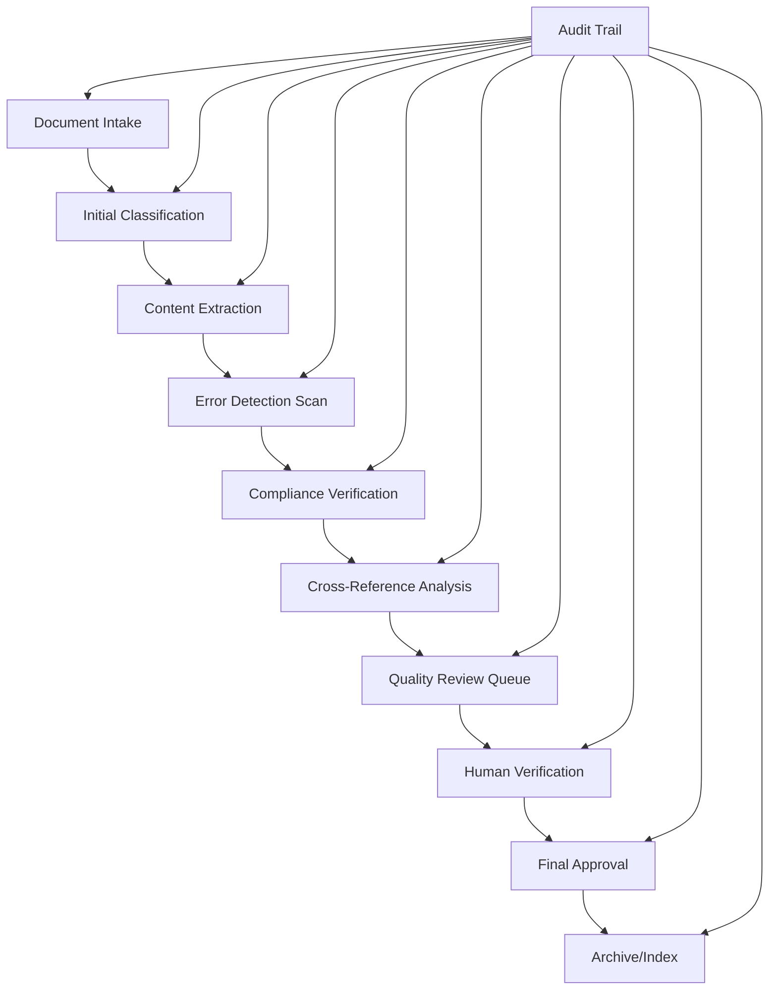
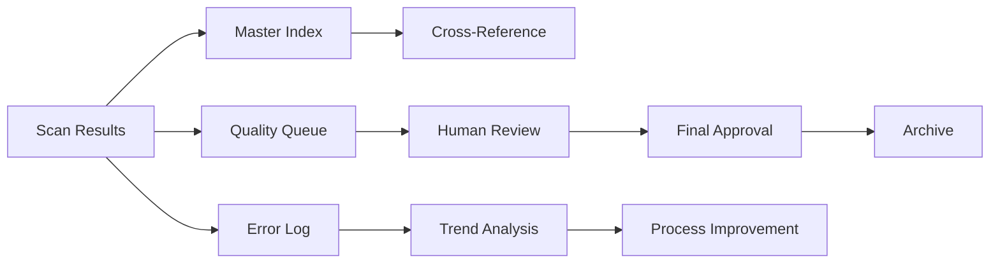

# Automated Review Scan Guide
## Bulk Scanning, Review, Error Detection, and Governance Compliance Workflow

**Version:** 1.0  
**Classification:** Medical/Legal Investigation Support  
**Retention:** Permanent  
**Last Updated:** [DATE OF IMPLEMENTATION]

---

## Purpose

This guide establishes comprehensive procedures for automated and semi-automated review scanning of large document sets in medical/legal investigations. The workflow ensures systematic error detection, governance compliance verification, cross-referencing accuracy, and maintains complete audit trails for legal admissibility.

---

## Automated Review Framework

### System Architecture



### Core Components

#### 1. Document Intake System
- **Purpose**: Automated reception and initial processing of document sets
- **Functions**:
  - File format validation
  - Virus and malware scanning
  - Metadata extraction
  - Initial integrity verification
  - Batch assignment and tracking

#### 2. Classification Engine
- **Purpose**: Automated document categorization and prioritization
- **Categories**:
  - Medical records (MED)
  - Regulatory documents (REG)
  - Legal correspondence (LEGAL)
  - Evidence materials (EVID)
  - Supporting documentation (SUPP)

#### 3. Content Analysis Module
- **Purpose**: Extract and analyze document content for patterns and anomalies
- **Capabilities**:
  - Text extraction (OCR for scanned documents)
  - Pattern recognition
  - Keyword identification
  - Date/time extraction
  - Person/entity identification

---

## Scanning Procedures

### Bulk Scan Initialization

#### Pre-Scan Checklist
- [ ] System capacity verification (storage, processing power)
- [ ] Staff resources allocated
- [ ] Quality control personnel assigned
- [ ] Timeline and milestones established
- [ ] Escalation procedures activated
- [ ] Backup systems verified

#### Scan Configuration
```yaml
Scan Configuration Template:
  scan_id: [SCAN-YYYY-MM-DD-###]
  case_reference: [CASE-ID]
  document_count: [NUMBER]
  estimated_duration: [HOURS]
  priority_level: [HIGH/MEDIUM/LOW]
  
  parameters:
    ocr_enabled: [true/false]
    language_detection: [enabled/disabled]
    compliance_rules: [ruleset_name]
    error_detection_level: [comprehensive/standard/basic]
    cross_reference_depth: [deep/standard/minimal]
    
  quality_controls:
    sample_verification_rate: [percentage]
    human_review_threshold: [confidence_level]
    escalation_triggers: [criteria_list]
```

### Phase 1: Initial Document Processing

#### Automated Processing Steps
1. **File Validation**
   - Format compatibility verification
   - Corruption detection
   - Security scanning
   - Metadata preservation

2. **Content Extraction**
   - Text extraction (OCR if needed)
   - Image analysis
   - Table/form recognition
   - Structural analysis

3. **Initial Categorization**
   - Document type identification
   - Sensitivity classification
   - Priority assignment
   - Routing determination

#### Processing Log Template
```markdown
## Document Processing: [PROCESS-ID]
**Document:** [FILENAME]
**Scan ID:** [SCAN-ID]
**Processed:** [YYYY-MM-DD HH:MM:SS UTC]
**Processor:** [SYSTEM/USER]

### Results
**Format:** [FORMAT] - [STATUS]
**Content Extraction:** [SUCCESS/PARTIAL/FAILED]
**Text Quality Score:** [0-100]
**Classification:** [CATEGORY] - [CONFIDENCE]
**Estimated Review Time:** [MINUTES]

### Issues Detected
- [ISSUE 1]: [SEVERITY] - [RESOLUTION]
- [ISSUE 2]: [SEVERITY] - [RESOLUTION]

### Next Steps
- [ ] [ACTION 1]
- [ ] [ACTION 2]
```

---

## Error Detection Protocols

### Automated Error Detection Rules

#### Document Integrity Errors
| Error Type | Detection Method | Severity | Action |
|------------|------------------|----------|--------|
| Incomplete Document | Page count analysis | HIGH | Manual review |
| Corrupted Content | Checksum verification | CRITICAL | Re-acquisition |
| Missing Metadata | Field validation | MEDIUM | Supplemental research |
| Format Inconsistency | Standard comparison | LOW | Standardization |

#### Content Accuracy Errors
| Error Type | Detection Pattern | Examples | Verification Method |
|------------|-------------------|----------|-------------------|
| Date Inconsistencies | Date logic analysis | Future dates, impossible sequences | Cross-reference |
| Duplicate Content | Hash comparison | Identical text blocks | Manual verification |
| Missing Information | Template comparison | Incomplete forms | Source validation |
| Conflicting Data | Cross-document analysis | Contradictory statements | Expert review |

#### Compliance Violations
| Violation Type | Detection Criteria | Regulatory Basis | Response |
|----------------|-------------------|------------------|----------|
| Privacy Breach | PII exposure patterns | HIPAA | Immediate isolation |
| Retention Violation | Date-based analysis | Legal requirements | Compliance review |
| Access Control | Permission verification | Security policies | Access audit |

### Error Classification Matrix

```markdown
## Error Severity Levels

**CRITICAL (Level 1)**
- Patient safety implications
- Legal admissibility threats
- Regulatory violation risks
- Data integrity failures

**HIGH (Level 2)**
- Significant content errors
- Process compliance deviations
- Quality standard violations
- Timeline impact risks

**MEDIUM (Level 3)**
- Minor content inconsistencies
- Formatting irregularities
- Non-critical process deviations
- Efficiency impact issues

**LOW (Level 4)**
- Cosmetic issues
- Style inconsistencies
- Minor metadata gaps
- Enhancement opportunities
```

---

## Compliance Verification Workflow

### Regulatory Compliance Scanning

#### HIPAA Compliance Check
```markdown
HIPAA Compliance Verification:
- [ ] PHI properly redacted or authorized
- [ ] Access controls documented
- [ ] Minimum necessary standard applied
- [ ] Patient consent verified where required
- [ ] Breach risk assessment completed
```

#### 21 CFR Part 11 Compliance
```markdown
Electronic Records Compliance:
- [ ] Audit trail completeness
- [ ] Electronic signature validation
- [ ] System access controls verified
- [ ] Data integrity measures confirmed
- [ ] Change control documentation
```

#### Legal Admissibility Standards
```markdown
Evidence Standards Verification:
- [ ] Chain of custody maintained
- [ ] Authentication methods documented
- [ ] Best evidence rule compliance
- [ ] Hearsay exception applicability
- [ ] Expert witness requirements met
```

### Compliance Scoring System
| Compliance Area | Weight | Score (0-100) | Weighted Score |
|-----------------|--------|---------------|----------------|
| Privacy Protection | 25% | [SCORE] | [WEIGHTED] |
| Data Integrity | 25% | [SCORE] | [WEIGHTED] |
| Access Control | 20% | [SCORE] | [WEIGHTED] |
| Audit Trail | 15% | [SCORE] | [WEIGHTED] |
| Documentation | 15% | [SCORE] | [WEIGHTED] |
| **Total Compliance Score** | **100%** | | **[TOTAL]** |

---

## Cross-Reference Analysis

### Reference Verification System

#### Internal Cross-References
- **Document-to-Document**: Verify citations and references between documents
- **Data Consistency**: Check for contradictory information across sources
- **Timeline Verification**: Ensure chronological consistency
- **Entity Matching**: Verify person, organization, and location references

#### External Cross-References
- **Regulatory Database**: Verify compliance with current regulations
- **Medical Standards**: Check against established clinical guidelines
- **Legal Precedents**: Validate against relevant case law
- **Industry Standards**: Ensure alignment with best practices

### Cross-Reference Matrix
```markdown
## Cross-Reference Analysis: [ANALYSIS-ID]
**Document Set:** [SET-ID]
**Analysis Date:** [YYYY-MM-DD]
**Analyst:** [NAME/SYSTEM]

### Internal References
| Source Doc | Target Doc | Reference Type | Status | Issues |
|------------|------------|----------------|--------|--------|
| [DOC-1] | [DOC-2] | Citation | [VERIFIED/FAILED] | [ISSUES] |
| [DOC-2] | [DOC-3] | Data Reference | [VERIFIED/FAILED] | [ISSUES] |

### External References
| Document | External Source | Reference Type | Verification Status |
|----------|----------------|----------------|-------------------|
| [DOC-1] | [REGULATION] | Compliance | [CURRENT/OUTDATED/INVALID] |
| [DOC-2] | [STANDARD] | Best Practice | [CURRENT/OUTDATED/INVALID] |

### Consistency Analysis
**Timeline Consistency:** [PASS/FAIL] - [DETAILS]
**Data Consistency:** [PASS/FAIL] - [DETAILS]
**Regulatory Alignment:** [PASS/FAIL] - [DETAILS]
```

---

## Quality Review Process

### Human Review Queue Management

#### Priority Scoring Algorithm
```python
# Priority scoring constants for forensic medical investigation review queue
CRITICAL_ERROR_WEIGHT = 100    # Weight for critical errors affecting patient safety/legal admissibility
HIGH_ERROR_WEIGHT = 50         # Weight for high priority errors requiring urgent attention  
MEDIUM_ERROR_WEIGHT = 20       # Weight for medium priority errors with moderate impact

EVIDENCE_CATEGORY_WEIGHT = 30      # Weight for evidence documents in legal proceedings
MEDICAL_CATEGORY_WEIGHT = 25       # Weight for medical records and clinical documentation
REGULATORY_CATEGORY_WEIGHT = 20    # Weight for regulatory compliance documents

MAXIMUM_PRIORITY_SCORE = 200   # Cap to prevent score overflow and maintain queue balance

def calculate_review_priority(document):
    """
    Calculate priority score for document review queue management.
    
    Args:
        document: Document object with error counts, category, and risk scores
        
    Returns:
        int: Priority score capped at MAXIMUM_PRIORITY_SCORE
    """
    score = 0
    
    # Error severity weighting - critical issues take precedence
    if document.critical_errors > 0:
        score += CRITICAL_ERROR_WEIGHT
    if document.high_errors > 0:
        score += HIGH_ERROR_WEIGHT
    if document.medium_errors > 0:
        score += MEDIUM_ERROR_WEIGHT
    
    # Document importance - legal and medical documents prioritized
    if document.category == "EVIDENCE":
        score += EVIDENCE_CATEGORY_WEIGHT
    elif document.category == "MEDICAL":
        score += MEDICAL_CATEGORY_WEIGHT
    elif document.category == "REGULATORY":
        score += REGULATORY_CATEGORY_WEIGHT
    
    # Additional risk factors
    score += document.compliance_risk_score
    score += document.case_priority_multiplier
    
    # Ensure score doesn't exceed maximum to maintain queue balance
    return min(score, MAXIMUM_PRIORITY_SCORE)
```

#### Review Assignment Criteria
| Reviewer Type | Document Types | Error Levels | Qualifications |
|---------------|----------------|--------------|----------------|
| Medical Expert | Medical records, clinical data | All levels | Medical credentials |
| Legal Reviewer | Legal documents, evidence | High/Critical | Legal background |
| Compliance Officer | Regulatory documents | Medium+ | Compliance certification |
| Quality Analyst | All document types | Low/Medium | QA training |

### Review Documentation Template
```markdown
## Quality Review: [REVIEW-ID]
**Document:** [DOCUMENT-ID]
**Reviewer:** [NAME] ([CREDENTIALS])
**Review Date:** [YYYY-MM-DD HH:MM:SS UTC]
**Review Duration:** [MINUTES]

### Automated Scan Results
**Error Count:** [TOTAL] (Critical: [#], High: [#], Medium: [#], Low: [#])
**Compliance Score:** [SCORE]/100
**Cross-Reference Status:** [PASS/FAIL]

### Human Review Findings
**Content Accuracy:** [RATING 1-5]
**Completeness:** [RATING 1-5]
**Legal Sufficiency:** [RATING 1-5]
**Regulatory Compliance:** [RATING 1-5]

### Issues Identified
1. **[ISSUE 1]**
   - Severity: [LEVEL]
   - Impact: [DESCRIPTION]
   - Recommendation: [ACTION]

### Resolution Actions
- [ ] [ACTION 1] - [ASSIGNED TO] - [DUE DATE]
- [ ] [ACTION 2] - [ASSIGNED TO] - [DUE DATE]

### Final Assessment
**Overall Quality Rating:** [EXCELLENT/GOOD/SATISFACTORY/POOR]
**Recommended Action:** [APPROVE/CONDITIONAL/REJECT/REWORK]
**Comments:** [DETAILED COMMENTS]

**Reviewer Signature:** [DIGITAL SIGNATURE]
**Review Completion:** [YYYY-MM-DD HH:MM:SS UTC]
```

---

## Audit Trail Requirements

### Comprehensive Logging Framework

#### System Event Logging
```json
{
  "event_id": "[UUID]",
  "timestamp": "[YYYY-MM-DD HH:MM:SS.mmm UTC]",
  "event_type": "[SCAN/REVIEW/ERROR/DECISION]",
  "user_id": "[USER-ID]",
  "session_id": "[SESSION-ID]",
  "document_id": "[DOCUMENT-ID]",
  "action": "[SPECIFIC-ACTION]",
  "parameters": {
    "key": "value"
  },
  "result": "[SUCCESS/FAILURE/PARTIAL]",
  "error_details": "[ERROR-INFO]",
  "checksum": "[DATA-INTEGRITY-HASH]"
}
```

#### Decision Trail Documentation
Every system and human decision must be logged with:
- Decision criteria used
- Alternative options considered
- Rationale for final decision
- Approval chain documentation
- Impact assessment
- Reversal procedures if applicable

### Audit Report Generation

#### Daily Audit Summary
```markdown
## Daily Scan Audit Summary
**Date:** [YYYY-MM-DD]
**Report Generated:** [YYYY-MM-DD HH:MM:SS UTC]

### Processing Statistics
**Documents Processed:** [COUNT]
**Average Processing Time:** [MINUTES]
**Error Rate:** [PERCENTAGE]
**Compliance Score Average:** [SCORE]

### Error Summary
| Error Type | Count | Resolved | Pending |
|------------|-------|----------|---------|
| Critical | [#] | [#] | [#] |
| High | [#] | [#] | [#] |
| Medium | [#] | [#] | [#] |
| Low | [#] | [#] | [#] |

### Quality Metrics
**Review Completion Rate:** [PERCENTAGE]
**Average Review Time:** [MINUTES]
**Approval Rate:** [PERCENTAGE]
**Escalation Rate:** [PERCENTAGE]

### System Performance
**Uptime:** [PERCENTAGE]
**Average Response Time:** [MILLISECONDS]
**Storage Utilization:** [PERCENTAGE]
**Error Rate:** [PERCENTAGE]
```

---

## Performance Optimization

### System Performance Monitoring

#### Key Performance Indicators
| Metric | Target | Current | Threshold | Action Required |
|--------|--------|---------|-----------|-----------------|
| Processing Speed | 100 docs/hour | [ACTUAL] | 80 docs/hour | [YES/NO] |
| Error Detection Rate | 99.5% | [ACTUAL] | 99% | [YES/NO] |
| False Positive Rate | <5% | [ACTUAL] | 10% | [YES/NO] |
| Review Queue Time | <4 hours | [ACTUAL] | 8 hours | [YES/NO] |
| System Uptime | 99.9% | [ACTUAL] | 99% | [YES/NO] |

#### Optimization Strategies
1. **Processing Optimization**
   - Parallel processing implementation
   - Resource allocation optimization
   - Caching strategy enhancement
   - Database query optimization

2. **Queue Management**
   - Dynamic priority adjustment
   - Load balancing implementation
   - Workflow optimization
   - Resource scheduling

3. **Error Reduction**
   - Pattern analysis improvement
   - Machine learning integration
   - False positive minimization
   - Accuracy enhancement

---

## Escalation Procedures

### Escalation Triggers
| Condition | Trigger Threshold | Escalation Level | Response Time |
|-----------|------------------|------------------|---------------|
| Critical Error Rate | >1% | Management | 15 minutes |
| System Downtime | >15 minutes | IT Emergency | 5 minutes |
| Compliance Failure | Any instance | Legal/Compliance | 30 minutes |
| Quality Score Drop | <80% | Quality Manager | 1 hour |
| Review Backlog | >24 hours | Operations Manager | 2 hours |

### Escalation Response Protocol
1. **Immediate Assessment** (0-15 minutes)
   - Scope determination
   - Impact assessment
   - Resource requirement evaluation

2. **Response Activation** (15-30 minutes)
   - Appropriate team notification
   - Resource mobilization
   - Containment measures

3. **Resolution Implementation** (30 minutes - ongoing)
   - Corrective action execution
   - Progress monitoring
   - Stakeholder communication

4. **Follow-up Actions** (Post-resolution)
   - Root cause analysis
   - Process improvement implementation
   - Prevention measure deployment

---

## Integration with Infrastructure

### Cross-System Integration Points

#### Master Document Index
- Automatic entry creation for all scanned documents
- Status updates throughout the review process
- Cross-reference validation and updates
- Metadata synchronization

#### Error Log Integration
- Automatic error logging for detected issues
- Escalation trigger integration
- Resolution tracking and verification
- Trend analysis and reporting

#### Knowledge Base Updates
- Best practice capture from successful scans
- Error pattern documentation
- Process improvement recommendations
- Training material updates

### Data Flow Validation


---

## Training and Certification

### Required Training Programs

#### System Operators
- [ ] Automated scanning system operation
- [ ] Error detection and classification
- [ ] Quality control procedures
- [ ] Escalation protocols

#### Quality Reviewers
- [ ] Document review methodologies
- [ ] Compliance verification procedures
- [ ] Cross-reference analysis techniques
- [ ] Report generation and documentation

#### System Administrators
- [ ] System configuration and optimization
- [ ] Performance monitoring and tuning
- [ ] Backup and recovery procedures
- [ ] Security and access control management

### Certification Requirements
| Role | Required Certification | Renewal Period | Training Hours |
|------|----------------------|----------------|----------------|
| Scan Operator | Internal Certification | Annual | 16 hours |
| Quality Reviewer | Professional + Internal | Annual | 24 hours |
| System Admin | Technical + Internal | Annual | 32 hours |

---

## Version Control and Updates

| Version | Date | Author | Changes | Approval |
|---------|------|--------|---------|----------|
| 1.0 | [DATE] | System | Initial implementation | [APPROVER] |

---

## Emergency Procedures

### System Failure Response
1. **Immediate Actions**
   - Activate backup processing systems
   - Preserve current work state
   - Notify stakeholders
   - Assess data integrity

2. **Recovery Process**
   - Restore from latest backup
   - Verify system functionality
   - Resume processing operations
   - Validate data consistency

3. **Post-Incident**
   - Conduct failure analysis
   - Implement preventive measures
   - Update procedures
   - Enhance monitoring

---

## Notes

This Automated Review Scan Guide is critical for maintaining efficient, accurate, and compliant document review processes. Regular updates and improvements based on operational experience and technological advances are essential for continued effectiveness.

**Next Scheduled Review:** [DATE + 30 DAYS]  
**Responsible Party:** [TO BE ASSIGNED]  
**Review Criteria:** System performance, accuracy metrics, compliance adherence, and process efficiency