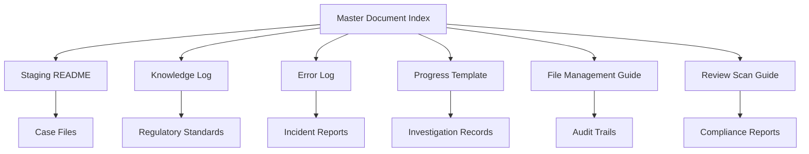

# Master Document Index
## Forensic-Grade Medical Investigation Infrastructure

**Version:** 1.0  
**Classification:** Medical/Legal Investigation Support  
**Retention:** Permanent  
**Last Updated:** [DATE OF IMPLEMENTATION]

---

## Purpose

This master index provides comprehensive tracking and management of all documents within the forensic-grade medical investigation infrastructure. Every document, file, and piece of evidence must be catalogued here with complete metadata for audit trail and legal admissibility purposes.

---

## Index Structure

### Document Categories

| Category Code | Description | Retention Period | Access Level |
|---------------|-------------|------------------|--------------|
| MED | Medical Records and Clinical Documentation | Permanent | Restricted |
| REG | Regulatory and Compliance Documents | Permanent | Controlled |
| LEGAL | Legal Documentation and Correspondence | Permanent | Highly Restricted |
| EVID | Evidence and Supporting Materials | Permanent | Restricted |
| PROC | Procedural Documentation and Workflows | 10 Years | Internal |
| QUAL | Quality Assurance and Validation Records | 10 Years | Controlled |

---

## Document Registry

### Template Entry Format
```
Document ID: [CATEGORY]-[YYYY-MM-DD]-[SEQUENCE]
Title: [Full Document Title]
Subject: [Brief Subject Description]
Date Created: [YYYY-MM-DD HH:MM:SS UTC]
Date Modified: [YYYY-MM-DD HH:MM:SS UTC]
Author: [Name and Role]
Reviewer: [Name and Role]
Approver: [Name and Role]
Classification: [Public/Internal/Controlled/Restricted/Highly Restricted]
Location: [Full File Path]
Checksum (SHA-256): [Hash Value]
Size: [File Size in Bytes]
Format: [File Format/Extension]
Related Cases: [Case ID References]
Keywords: [Searchable Tags]
Summary: [Brief Content Summary]
Status: [Draft/Under Review/Approved/Archived/Superseded]
Next Review Date: [YYYY-MM-DD]
```

---

## Active Documents

### System Infrastructure Documents

| Document ID | Title | Subject | Created | Author | Status | Location |
|-------------|-------|---------|---------|--------|--------|----------|
| PROC-[DATE]-001 | File Staging and Triage Procedures | Intake workflow standardization | [DATE] | System | Approved | `_STAGING_README.txt` |
| PROC-[DATE]-002 | Knowledge and Learning Log | Regulatory standards tracking | [DATE] | System | Approved | `KNOWLEDGE_AND_LEARNING_LOG.md` |
| PROC-[DATE]-003 | Forensic Error Log | Error and breach tracking | [DATE] | System | Approved | `FORENSIC_ERROR_LOG.md` |
| PROC-[DATE]-004 | Task Progress Template | Per-case investigation template | [DATE] | System | Approved | `TASK_PROGRESS_LOG_TEMPLATE.md` |
| PROC-[DATE]-005 | File Management Guide | File/folder movement procedures | [DATE] | System | Approved | `FILE_FOLDER_MANAGEMENT_GUIDE.md` |
| PROC-[DATE]-006 | Automated Review Scan Guide | Bulk scanning and compliance workflow | [DATE] | System | Approved | `AUTOMATED_REVIEW_SCAN_GUIDE.md` |
| PROC-[DATE]-007 | Master Document Index | Central document registry | [DATE] | System | Approved | `MASTER_DOCUMENT_INDEX.md` |

---

## Search and Retrieval

### Quick Reference Tags

- **#medical-records**: Medical documentation and clinical files
- **#regulatory**: Compliance and regulatory submissions
- **#legal**: Legal correspondence and documentation
- **#evidence**: Investigation evidence and supporting materials
- **#procedures**: Standard operating procedures
- **#quality**: Quality assurance and validation
- **#audit**: Audit trails and compliance verification
- **#security**: Security protocols and access controls

### Document Relationships



---

## Maintenance Procedures

### Regular Reviews
- **Weekly**: Verify all new document entries are complete
- **Monthly**: Validate checksums and file integrity
- **Quarterly**: Review and update classification levels
- **Annually**: Complete comprehensive audit of all documents

### Index Integrity Checks
1. Verify all referenced files exist at specified locations
2. Confirm checksums match current file states
3. Validate all metadata fields are complete
4. Check for orphaned or unregistered files
5. Review access permissions and security controls

### Update Procedures
1. All changes require dual approval
2. Previous versions must be archived with timestamps
3. Change logs must document reason for modification
4. Updated checksums must be calculated and verified
5. Related documents must be cross-referenced

---

## Compliance and Audit

### Regulatory Requirements
- All entries must comply with applicable medical record retention laws
- Legal documentation must meet court admissibility standards
- Audit trails must be complete and tamper-evident
- Access logs must be maintained for all document interactions

### Quality Assurance
- Regular verification of index accuracy and completeness
- Periodic validation of document integrity and accessibility
- Continuous monitoring of compliance with established procedures
- Documentation of any deviations or corrective actions

---

## Emergency Procedures

### Data Recovery
1. Immediate isolation of affected systems
2. Assessment of data integrity and loss extent
3. Activation of backup recovery procedures
4. Documentation of incident in Forensic Error Log
5. Restoration verification and validation

### Security Incidents
1. Immediate containment of security breach
2. Documentation of incident details and timeline
3. Assessment of data exposure and impact
4. Implementation of corrective measures
5. Regulatory notification if required

---

## Version Control

| Version | Date | Author | Changes | Approval |
|---------|------|--------|---------|----------|
| 1.0 | [DATE] | System | Initial implementation | [APPROVER] |

---

## Notes

This Master Document Index is a critical component of the forensic-grade medical investigation infrastructure. Accuracy and completeness are essential for maintaining legal admissibility and regulatory compliance. Any discrepancies or issues must be immediately reported and documented in the Forensic Error Log.

**Next Scheduled Review:** [DATE + 90 DAYS]  
**Responsible Party:** [TO BE ASSIGNED]  
**Review Criteria:** Accuracy, completeness, compliance, and accessibility of all indexed documents